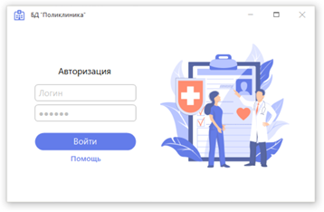

### PolyclinicApp: Управление медицинскими данными с использованием C#

PolyclinicApp - это приложение для управления медицинскими данными, разработанное с использованием языка программирования C#. Оно предназначено для поликлиник и медицинских учреждений, чтобы обеспечить эффективное хранение, обработку и доступ к данным о пациентах, врачах и медицинских процедурах.

#### Ключевые особенности:

1. **База данных SQL Server:** Приложение использует SQL Server для хранения медицинских данных, обеспечивая их надежность и производительность.

2. **ASP.NET MVC фреймворк для frontend:** Для создания удобного пользовательского интерфейса используется ASP.NET MVC, обеспечивающий интуитивно понятное взаимодействие с приложением.

3. **Аутентификация и авторизация:** Для обеспечения безопасности данных реализованы механизмы аутентификации и авторизации пользователей.

4. **Оптимизация производительности:** Применяются методы оптимизации базы данных и запросов для обеспечения быстрого доступа к информации.

#### Цель:

Цель PolyclinicApp - предоставить медицинским учреждениям эффективный инструмент для управления медицинскими данными, повышения качества обслуживания пациентов и оптимизации работы персонала.

#### План разработки:

План разработки включает в себя доработку пользовательского интерфейса, улучшение функциональности, обновление системы безопасности и оптимизацию производительности.

#### Скриншоты:

#### Связь со мной:
vk.com/true_lnz

t.me/lansonz

